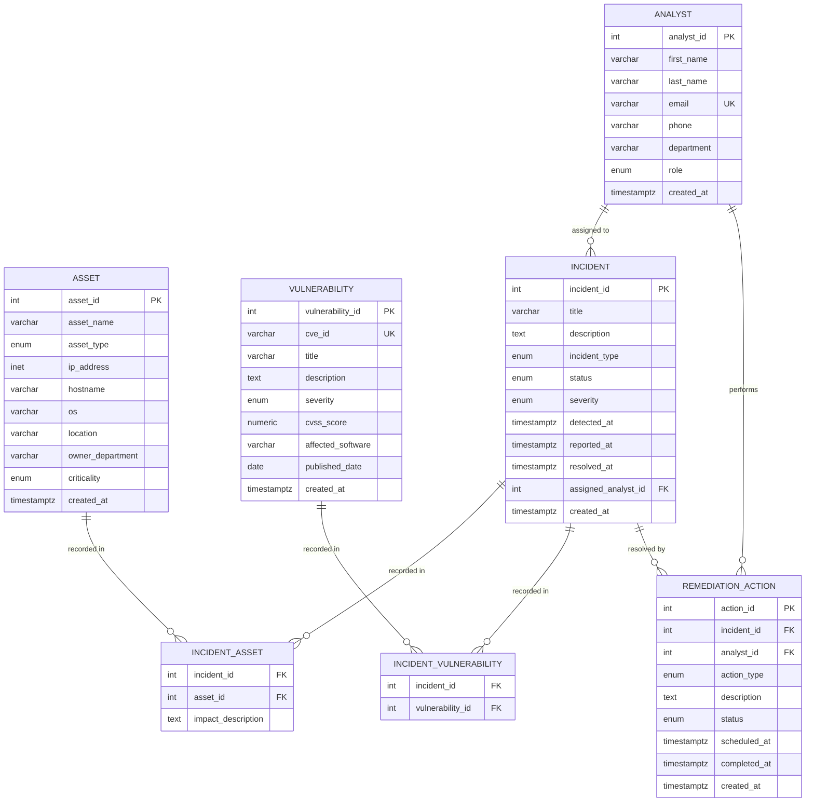

# Phase 1 — Conceptual Design

**Project:** Cybersecurity Incident Management System (CIMS)  
**Technology:** PostgreSQL (Relational Database)  
**Phase:** 1 — Requirements Analysis & Entity-Relationship Design

---

## Table of Contents

1. [System Overview](#1-system-overview)
2. [Stakeholders](#2-stakeholders)
3. [Functional Requirements](#3-functional-requirements)
4. [Non-Functional Requirements](#4-non-functional-requirements)
5. [Entity-Relationship (ER) Diagram](#5-entity-relationship-er-diagram)
6. [Entity Descriptions](#6-entity-descriptions)
7. [Relationship Descriptions](#7-relationship-descriptions)
8. [Business Rules & Integrity Constraints](#8-business-rules--integrity-constraints)
9. [Data Dictionary](#9-data-dictionary)

---

## 1. System Overview

### 1.1 Mini-World Description

A medium-to-large organisation operates an IT infrastructure containing many types of assets: physical servers, workstations, network devices, databases, business applications, mobile devices and cloud resources.

The organisation employs a dedicated **Security Operations Center (SOC)** staffed with security **analysts** of varying seniority. These analysts detect, investigate, and resolve **security incidents** — ranging from malware infections and ransomware attacks to data breaches, phishing campaigns, denial-of-service attacks, and insider threats.

Every incident may be linked to one or more known **vulnerabilities** (identified by CVE IDs or internal tracking numbers) that the attacker exploited, as well as to one or more **assets** that were affected or compromised. After an incident is recorded, analysts perform **remediation actions** — such as patching software, isolating hosts, blocking IPs, resetting credentials, or restoring from backup — to contain and resolve the threat.

The **Cybersecurity Incident Management System (CIMS)** is the relational database at the heart of this workflow. It is the single source of truth for all incident-related data, supporting operational dashboards, management reports, compliance audits, and post-incident reviews.

### 1.2 Scope

The system covers the following domains:

| Domain | Description |
|--------|-------------|
| **Analyst Management** | Track SOC and IR team members, their roles, and departments |
| **Asset Inventory** | Maintain a register of all IT assets and their criticality |
| **Vulnerability Tracking** | Record known CVEs and internal vulnerability findings |
| **Incident Lifecycle** | Capture every stage of a security incident from detection to closure |
| **Impact Analysis** | Link incidents to the specific assets and vulnerabilities involved |
| **Remediation Tracking** | Record and monitor every action taken to remediate an incident |

### 1.3 System Boundary

The database stores structured information about incidents, assets, vulnerabilities, analysts, and remediation actions. It does **not** store raw log files, packet captures, or binary evidence — those are handled by separate SIEM/SOAR systems.

---

## 2. Stakeholders

| Stakeholder | Role in the System |
|-------------|-------------------|
| **SOC Analyst (Junior/Senior)** | Creates incidents, updates statuses, logs remediation actions |
| **Incident Response Lead** | Reviews and assigns incidents, oversees remediation progress |
| **SOC Manager** | Views workload reports, MTTR metrics, and severity breakdowns |
| **Vulnerability Management Team** | Links CVEs to incidents, tracks which vulnerabilities are being exploited |
| **Compliance/Audit Team** | Reads incident history, reviews resolution timelines, exports reports |
| **IT Asset Owners** | Provide asset information; receive notifications when their assets are affected |
| **CISO (Chief Information Security Officer)** | Consumes executive dashboards from aggregated incident data |

---

## 3. Functional Requirements

### FR-1: Analyst Management
- **FR-1.1** The system shall store a record for each security analyst including their name, email, phone, department, and seniority role.
- **FR-1.2** Each analyst shall have a unique email address.
- **FR-1.3** The system shall support roles: *junior*, *senior*, *lead*, *manager*.

### FR-2: Asset Inventory
- **FR-2.1** The system shall maintain a register of all organisational IT assets.
- **FR-2.2** Each asset shall be categorised by type: *server*, *workstation*, *network_device*, *database*, *application*, *mobile_device*, *cloud_resource*.
- **FR-2.3** Each asset shall have a criticality rating: *low*, *medium*, *high*, or *critical*.
- **FR-2.4** Each asset must be identifiable by at least one of: IP address or hostname.
- **FR-2.5** The system shall record the owning department and physical/logical location of each asset.

### FR-3: Vulnerability Tracking
- **FR-3.1** The system shall record known vulnerabilities, including CVE identifier (where applicable), title, description, severity, and CVSS score.
- **FR-3.2** CVSS scores shall be validated to be in the range 0.0 – 10.0.
- **FR-3.3** CVE IDs shall be unique in the system.
- **FR-3.4** The system shall record the affected software and publication date for each vulnerability.

### FR-4: Incident Management
- **FR-4.1** The system shall record each security incident with a title, description, type, severity, and lifecycle status.
- **FR-4.2** Incident types supported: *malware*, *phishing*, *data_breach*, *dos*, *unauthorized_access*, *insider_threat*, *ransomware*, *other*.
- **FR-4.3** Incident statuses: *open* → *in_progress* → *resolved* → *closed*.
- **FR-4.4** The system shall record when an incident was detected, when it was reported, and when it was resolved.
- **FR-4.5** Each incident may be assigned to exactly one analyst. If the analyst is removed from the system, the incident record is preserved (analyst reference set to NULL).
- **FR-4.6** The resolved timestamp shall never be earlier than the detected timestamp.

### FR-5: Impact Tracking
- **FR-5.1** The system shall record which assets were affected by a given incident (many-to-many).
- **FR-5.2** Each affected-asset link shall optionally describe the nature of the impact.
- **FR-5.3** The system shall record which vulnerabilities were exploited in a given incident (many-to-many).

### FR-6: Remediation Tracking
- **FR-6.1** The system shall record one or more remediation actions per incident.
- **FR-6.2** Action types: *patch*, *isolate*, *block_ip*, *reset_credentials*, *backup_restore*, *config_change*, *scan*, *monitor*, *other*.
- **FR-6.3** Action statuses: *pending*, *in_progress*, *completed*, *failed*.
- **FR-6.4** Each action may optionally be assigned to an analyst. If the analyst is removed, the action record is preserved.
- **FR-6.5** The completion timestamp shall never be earlier than the scheduled timestamp.

### FR-7: Reporting & Queries
- **FR-7.1** The system shall support querying all open and in-progress incidents with analyst assignment.
- **FR-7.2** The system shall support per-incident summaries showing affected asset count, exploited vulnerability count, and remediation completion percentage.
- **FR-7.3** The system shall support Mean Time to Resolve (MTTR) calculations grouped by incident type.
- **FR-7.4** The system shall support analyst workload reports showing active and critical incident counts.
- **FR-7.5** The system shall support identifying the most affected assets and most exploited vulnerabilities.
- **FR-7.6** The system shall support incident trend analysis over time (monthly breakdown).

---

## 4. Non-Functional Requirements

| # | Requirement |
|---|-------------|
| **NFR-1** | All categorical fields shall use database-level ENUM types to enforce domain integrity |
| **NFR-2** | All business rules that can be expressed as CHECK constraints shall be enforced at the database level |
| **NFR-3** | Foreign keys shall cascade deletes to child tables; analyst references shall use SET NULL to preserve history |
| **NFR-4** | Indexes shall be created on all foreign key columns and high-frequency filter columns (`status`, `severity`, `detected_at`) |
| **NFR-5** | All timestamps shall be stored as `TIMESTAMPTZ` (timezone-aware) |
| **NFR-6** | The schema shall be in Third Normal Form (3NF) — no partial or transitive dependencies |

---

## 5. Entity-Relationship (ER) Diagram

> **Note:** GitHub renders Mermaid diagrams natively. The diagram below is fully interactive in the GitHub web UI.

### Cardinality Summary

| Relationship | Cardinality | Description |
|---|---|---|
| ANALYST → INCIDENT | 1 : 0..N | An analyst can be assigned to many incidents; each incident has at most one assigned analyst |
| ANALYST → REMEDIATION_ACTION | 1 : 0..N | An analyst can perform many actions; each action is performed by at most one analyst |
| INCIDENT → ASSET | M : N | An incident may affect many assets; an asset may appear in many incidents |
| INCIDENT → VULNERABILITY | M : N | An incident may exploit many vulnerabilities; a vulnerability may appear in many incidents |
| INCIDENT → REMEDIATION_ACTION | 1 : 0..N | An incident has zero or more remediation actions; each action belongs to exactly one incident |

---

## 6. Entity Descriptions

### 6.1 ANALYST

Represents a security professional employed by the organisation who investigates and responds to incidents. Analysts are grouped into departments (e.g. SOC, Incident Response, Threat Intelligence) and have a seniority role.

**Key characteristic:** Each analyst is uniquely identified by their email address in addition to the system-generated `analyst_id`.

### 6.2 ASSET

Represents any IT resource that the organisation owns or operates and that could be affected by a security incident. Assets span the full spectrum of infrastructure: physical servers, employee workstations, network appliances, databases, business applications, mobile devices, and cloud-hosted resources.

**Key characteristic:** Every asset must be locatable — either by IP address, hostname, or both. A record with neither is rejected by a CHECK constraint.

### 6.3 VULNERABILITY

Represents a known security weakness. Vulnerabilities are referenced by CVE identifier where one exists; internally-identified weaknesses (e.g. a misconfigured S3 bucket) are recorded without a CVE ID. CVSS scores quantify severity on a 0–10 scale.

**Key characteristic:** CVE IDs are globally unique and enforced as UNIQUE in the database.

### 6.4 INCIDENT

The central entity of the system. Represents a confirmed or suspected security event that requires investigation and response. An incident has a full lifecycle: *open* → *in_progress* → *resolved* → *closed*.

**Key characteristic:** Every incident tracks when it was detected (event time) and when it was reported (entry time). These two timestamps allow calculation of detection lag. The resolved timestamp, when present, allows MTTR calculation.

### 6.5 INCIDENT_ASSET *(associative entity)*

Resolves the many-to-many relationship between INCIDENT and ASSET. Records which specific assets were involved in (or affected by) a given incident. An optional `impact_description` field captures the nature of the impact on that specific asset.

### 6.6 INCIDENT_VULNERABILITY *(associative entity)*

Resolves the many-to-many relationship between INCIDENT and VULNERABILITY. Records which vulnerabilities were exploited or associated with a given incident. This allows the team to track which CVEs are being actively used in attacks in the wild.

### 6.7 REMEDIATION_ACTION

Represents a concrete step taken (or planned) to contain, eradicate, or recover from an incident. Actions are typed (e.g. *patch*, *isolate*, *block_ip*) and have their own status lifecycle (*pending* → *in_progress* → *completed* / *failed*). Scheduled and completion timestamps support SLA tracking.

---

## 7. Relationship Descriptions

### 7.1 ANALYST — *assigned to* — INCIDENT
- **Type:** One-to-Many (1:N)
- **Participation:** An incident has **optional** analyst assignment (partial participation on the INCIDENT side; an incident may be unassigned initially)
- **Constraint:** If an analyst record is deleted, the `assigned_analyst_id` on all their incidents is set to NULL (history preserved)

### 7.2 ANALYST — *performs* — REMEDIATION_ACTION
- **Type:** One-to-Many (1:N)
- **Participation:** A remediation action has **optional** analyst assignment (it may be unassigned/pending)
- **Constraint:** If an analyst is deleted, `analyst_id` on their actions is set to NULL

### 7.3 INCIDENT — *affects* — ASSET *(via INCIDENT_ASSET)*
- **Type:** Many-to-Many (M:N)
- **Participation:** Partial on both sides (an incident may have zero known assets; an asset may not yet appear in any incident)
- **Associative attributes:** `impact_description`

### 7.4 INCIDENT — *exploits* — VULNERABILITY *(via INCIDENT_VULNERABILITY)*
- **Type:** Many-to-Many (M:N)
- **Participation:** Partial on both sides (an incident may not yet have a known CVE link; a vulnerability may not yet have been seen in an incident)

### 7.5 INCIDENT — *resolved by* — REMEDIATION_ACTION
- **Type:** One-to-Many (1:N)
- **Participation:** Total participation on the REMEDIATION_ACTION side (every action belongs to exactly one incident); partial on the INCIDENT side (an incident may have zero actions initially)
- **Constraint:** Deleting an incident cascades to delete all its associated remediation actions

---

## 8. Business Rules & Integrity Constraints

| ID | Rule | Enforcement |
|----|------|-------------|
| **BR-1** | An incident's resolution time must be on or after its detection time | `CHECK (resolved_at IS NULL OR resolved_at >= detected_at)` |
| **BR-2** | An asset must have at least one identifier: IP address or hostname (or both) | `CHECK (ip_address IS NOT NULL OR hostname IS NOT NULL)` |
| **BR-3** | A vulnerability's CVSS score must be between 0.0 and 10.0 inclusive | `CHECK (cvss_score BETWEEN 0.0 AND 10.0)` |
| **BR-4** | A remediation action's completion time must be on or after its scheduled time | `CHECK (completed_at IS NULL OR scheduled_at IS NULL OR completed_at >= scheduled_at)` |
| **BR-5** | Each analyst email must be unique across all analysts | `UNIQUE (email)` |
| **BR-6** | Each CVE ID must be unique across all vulnerabilities | `UNIQUE (cve_id)` |
| **BR-7** | An asset cannot appear twice in the same incident | Composite `PRIMARY KEY (incident_id, asset_id)` on `incident_assets` |
| **BR-8** | A vulnerability cannot appear twice in the same incident | Composite `PRIMARY KEY (incident_id, vulnerability_id)` on `incident_vulnerabilities` |
| **BR-9** | Deleting an incident removes all its asset links, vulnerability links, and remediation actions | `ON DELETE CASCADE` on all child tables referencing `incidents` |
| **BR-10** | Deleting an analyst does not remove their incident or action history | `ON DELETE SET NULL` on `incidents.assigned_analyst_id` and `remediation_actions.analyst_id` |
| **BR-11** | All categorical fields (role, asset_type, severity, incident_type, etc.) are restricted to defined values | PostgreSQL `ENUM` types |

---

## 9. Data Dictionary

### 9.1 ANALYST

| Column | Data Type | Constraints | Description |
|--------|-----------|-------------|-------------|
| `analyst_id` | `SERIAL` (INT) | `PRIMARY KEY` | Auto-incremented unique identifier |
| `first_name` | `VARCHAR(100)` | `NOT NULL` | Analyst's first (given) name |
| `last_name` | `VARCHAR(100)` | `NOT NULL` | Analyst's surname |
| `email` | `VARCHAR(255)` | `NOT NULL`, `UNIQUE` | Work email address — used as natural key |
| `phone` | `VARCHAR(30)` | nullable | Contact phone number |
| `department` | `VARCHAR(100)` | `NOT NULL` | Organisational department (e.g. SOC, Incident Response) |
| `role` | `analyst_role` | `NOT NULL`, default `'junior'` | Seniority level: `junior` \| `senior` \| `lead` \| `manager` |
| `created_at` | `TIMESTAMPTZ` | `NOT NULL`, default `NOW()` | Record creation timestamp |

### 9.2 ASSET

| Column | Data Type | Constraints | Description |
|--------|-----------|-------------|-------------|
| `asset_id` | `SERIAL` (INT) | `PRIMARY KEY` | Auto-incremented unique identifier |
| `asset_name` | `VARCHAR(200)` | `NOT NULL` | Human-readable asset name (e.g. "Primary Web Server") |
| `asset_type` | `asset_type` | `NOT NULL` | Category: `server` \| `workstation` \| `network_device` \| `database` \| `application` \| `mobile_device` \| `cloud_resource` |
| `ip_address` | `INET` | nullable | IPv4 or IPv6 address |
| `hostname` | `VARCHAR(255)` | nullable | Fully-qualified domain name or short hostname |
| `os` | `VARCHAR(100)` | nullable | Operating system or platform (e.g. "Ubuntu 22.04 LTS") |
| `location` | `VARCHAR(200)` | nullable | Physical or logical location (data centre, office floor, cloud region) |
| `owner_department` | `VARCHAR(100)` | `NOT NULL` | Department that owns/operates the asset |
| `criticality` | `criticality_level` | `NOT NULL`, default `'medium'` | Business importance: `low` \| `medium` \| `high` \| `critical` |
| `created_at` | `TIMESTAMPTZ` | `NOT NULL`, default `NOW()` | Record creation timestamp |

> **Constraint:** At least one of `ip_address` or `hostname` must be non-NULL.

### 9.3 VULNERABILITY

| Column | Data Type | Constraints | Description |
|--------|-----------|-------------|-------------|
| `vulnerability_id` | `SERIAL` (INT) | `PRIMARY KEY` | Auto-incremented unique identifier |
| `cve_id` | `VARCHAR(20)` | `UNIQUE`, nullable | CVE identifier (e.g. `CVE-2021-44228`); NULL for internal findings |
| `title` | `VARCHAR(300)` | `NOT NULL` | Short descriptive name of the vulnerability |
| `description` | `TEXT` | nullable | Full technical description |
| `severity` | `severity_level` | `NOT NULL` | `low` \| `medium` \| `high` \| `critical` |
| `cvss_score` | `NUMERIC(3,1)` | check 0.0–10.0 | CVSS v3 base score |
| `affected_software` | `VARCHAR(300)` | nullable | Affected product(s) and version range |
| `published_date` | `DATE` | nullable | Date the vulnerability was publicly disclosed |
| `created_at` | `TIMESTAMPTZ` | `NOT NULL`, default `NOW()` | Record creation timestamp |

### 9.4 INCIDENT

| Column | Data Type | Constraints | Description |
|--------|-----------|-------------|-------------|
| `incident_id` | `SERIAL` (INT) | `PRIMARY KEY` | Auto-incremented unique identifier |
| `title` | `VARCHAR(300)` | `NOT NULL` | Short descriptive title |
| `description` | `TEXT` | nullable | Detailed narrative of the incident |
| `incident_type` | `incident_type` | `NOT NULL` | `malware` \| `phishing` \| `data_breach` \| `dos` \| `unauthorized_access` \| `insider_threat` \| `ransomware` \| `other` |
| `status` | `incident_status` | `NOT NULL`, default `'open'` | Lifecycle state: `open` \| `in_progress` \| `resolved` \| `closed` |
| `severity` | `severity_level` | `NOT NULL` | `low` \| `medium` \| `high` \| `critical` |
| `detected_at` | `TIMESTAMPTZ` | `NOT NULL` | Timestamp when the incident was first detected |
| `reported_at` | `TIMESTAMPTZ` | `NOT NULL`, default `NOW()` | Timestamp when the incident was entered into the system |
| `resolved_at` | `TIMESTAMPTZ` | nullable | Timestamp when the incident was resolved; NULL if still open |
| `assigned_analyst_id` | `INT` | FK → `analysts(analyst_id)` SET NULL | The analyst currently responsible for the incident |
| `created_at` | `TIMESTAMPTZ` | `NOT NULL`, default `NOW()` | Record creation timestamp |

> **Constraint:** `resolved_at >= detected_at` when not NULL.

### 9.5 INCIDENT_ASSET *(junction table)*

| Column | Data Type | Constraints | Description |
|--------|-----------|-------------|-------------|
| `incident_id` | `INT` | `PK`, FK → `incidents` CASCADE | Reference to the incident |
| `asset_id` | `INT` | `PK`, FK → `assets` CASCADE | Reference to the affected asset |
| `impact_description` | `TEXT` | nullable | Free-text description of how this specific asset was impacted |

### 9.6 INCIDENT_VULNERABILITY *(junction table)*

| Column | Data Type | Constraints | Description |
|--------|-----------|-------------|-------------|
| `incident_id` | `INT` | `PK`, FK → `incidents` CASCADE | Reference to the incident |
| `vulnerability_id` | `INT` | `PK`, FK → `vulnerabilities` CASCADE | Reference to the exploited vulnerability |

### 9.7 REMEDIATION_ACTION

| Column | Data Type | Constraints | Description |
|--------|-----------|-------------|-------------|
| `action_id` | `SERIAL` (INT) | `PRIMARY KEY` | Auto-incremented unique identifier |
| `incident_id` | `INT` | `NOT NULL`, FK → `incidents` CASCADE | The incident this action addresses |
| `analyst_id` | `INT` | FK → `analysts` SET NULL | The analyst assigned to carry out this action |
| `action_type` | `action_type` | `NOT NULL` | `patch` \| `isolate` \| `block_ip` \| `reset_credentials` \| `backup_restore` \| `config_change` \| `scan` \| `monitor` \| `other` |
| `description` | `TEXT` | `NOT NULL` | Detailed description of the action |
| `status` | `action_status` | `NOT NULL`, default `'pending'` | `pending` \| `in_progress` \| `completed` \| `failed` |
| `scheduled_at` | `TIMESTAMPTZ` | nullable | When the action is/was scheduled to be performed |
| `completed_at` | `TIMESTAMPTZ` | nullable | When the action was completed; NULL if still in progress |
| `created_at` | `TIMESTAMPTZ` | `NOT NULL`, default `NOW()` | Record creation timestamp |

> **Constraint:** `completed_at >= scheduled_at` when both are non-NULL.

---

## ENUM Type Reference

| ENUM Name | Values |
|-----------|--------|
| `analyst_role` | `junior`, `senior`, `lead`, `manager` |
| `asset_type` | `server`, `workstation`, `network_device`, `database`, `application`, `mobile_device`, `cloud_resource` |
| `criticality_level` | `low`, `medium`, `high`, `critical` |
| `severity_level` | `low`, `medium`, `high`, `critical` |
| `incident_type` | `malware`, `phishing`, `data_breach`, `dos`, `unauthorized_access`, `insider_threat`, `ransomware`, `other` |
| `incident_status` | `open`, `in_progress`, `resolved`, `closed` |
| `action_type` | `patch`, `isolate`, `block_ip`, `reset_credentials`, `backup_restore`, `config_change`, `scan`, `monitor`, `other` |
| `action_status` | `pending`, `in_progress`, `completed`, `failed` |
